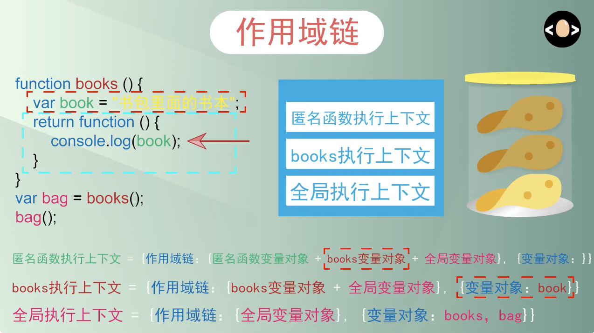
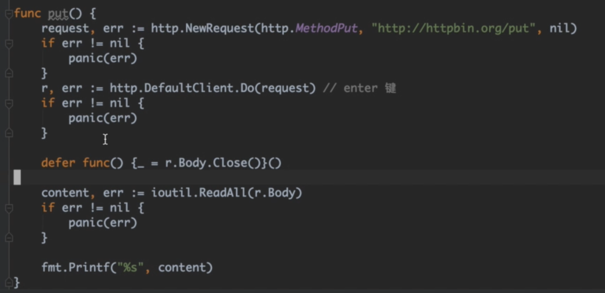

# myGoMemos

---

## concurrency

```go
func main() {
	go greet("Nice to meet you!")
	go greet("How are you?")
	go slowGreet("How ... are ... you ...?")
	go greet("I hope you're liking the course!")
}
```

在运行这些函数作为 goroutines 时,我们在控制台上看不到任何输出。这是因为 goroutine 的设计目的是以非阻塞的方式运行函数,以便后续的操作和函数调用可以立即执行。当我们在 main 函数中启动这四个 goroutines 时,main 函数会立即结束并退出程序,导致我们看不到控制台输出。这是因为 goroutines 的特性是不会返回值,而调用它们的地方也不会等待它们完成。

- goroutine 旨在以非阻塞的方式运行函数
- 主函数会立即退出,而不会等待 goroutines 执行完毕
- goroutines 不会返回值,因此调用它们的地方也不会等待它们完成

## 数据类型

用断言来处理不同类型数据：

```go
func printSomething(value interface{}) {
    intVal, ok := value.(int)

    if ok {
        fmt.Println("Integer:", intVal)
        return
    }

    floatVal, ok := value.(float64)

    if ok {
        fmt.Println("Float:", floatVal)
        return
    }

    stringVal, ok := value.(string)

    if ok {
        fmt.Println("String:", stringVal)
        return
    }
}
```

用 switch 来处理不同类型的数据：

```go
func printSomething(value interface{}) {
    switch value.(type) {
    case int:
        fmt.Println("Integer:", value)
    case float64:
        fmt.Println("Float:", value)
    case string:
        fmt.Println(value)
    }
}
```

## 闭包

闭包适合用来保存执行环境，也就是执行上下文


```go
package main

import "fmt"

func main() {
    numbers := []int{1, 2, 3}

    double := createTransformer(2)
    triple := createTransformer(3)

    transformed := transformNumbers(&numbers, func(number int) int {
        return number * 2
    })

    doubled := transformNumbers(&numbers, double)
    tripled := transformNumbers(&numbers, triple)

    fmt.Println(transformed)
    fmt.Println(doubled)
    fmt.Println(tripled)
}

func transformNumbers(numbers *[]int, transform func(int) int) []int {
    dNumbers := []int{}

    for _, val := range *numbers {
        dNumbers = append(dNumbers, transform(val))
    }

    return dNumbers
}

//工厂函数，生产出不同配置的函数

func createTransformer(factor int) func(int) int {
    return func(number int) int {
        return number * factor
    }
}
```

## 匿名函数

好处，不需事先定义，要用时定义，适合一次性场景，提高可读性

例子：

```go
package main

import "fmt"

func main() {
    numbers := []int{1, 2, 3}

    transformed := transformNumbers(&numbers, ???)

    // 这里的？？？可以写一个匿名函数，如下：

    transformed := transformNumbers(&numbers, func(number int) int {
        return number * 2
    })

    fmt.Println(transformed)
}

func transformNumbers(numbers *[]int, transform func(int) int) []int {
    dNumbers := []int{}

    for _, val := range *numbers {
        dNumbers = append(dNumbers, transform(val))
    }

    return dNumbers
}
```

## Pointer

```go
var a int //变量
var b_pt *int = &a // 指针

fmt.Print(&a) // a的地址 等于b_pt
fmt.Print(*b_pt) // 等于a的值

func ScanPara(para *int){} //参数为一个指针类型
```

在 Go 中，需要修改原数据的操作，用 Pointer 比较好
类似 Scan 函数 Scan( &para )

在操作大型 Struct 或 Array 时，用数组可以提升效率

## IO

主要是`io`和`os`包。这些操作包括读取输入、写入输出到文件或标准输出（如控制台）。

### 1. 文件读取和写入

`os`包来打开或创建文件，`io`或`bufio`包来读取或写入文件。

#### 写入文件

在 Go 中创建并写入文件：

```go
package main

import (
    "os"
    "log"
)

func main() {
    file, err := os.Create("example.txt")
    if err != nil {
        log.Fatal(err)
    }
    defer file.Close()

    _, err = file.WriteString("Hello, world!\n")
    if err != nil {
        log.Fatal(err)
    }
}
```

`os.Create`函数创建一个名为`example.txt`的文件，如果文件创建成功，则使用`WriteString`方法写入一些文本。`defer file.Close()`确保在函数退出前关闭文件。

#### 读取文件

```go
package main

import (
    "bufio"
    "os"
    "log"
    "fmt"
)

func main() {
    file, err := os.Open("example.txt")
    if err != nil {
        log.Fatal(err)
    }
    defer file.Close()

    scanner := bufio.NewScanner(file)
    for scanner.Scan() {
        fmt.Println(scanner.Text())
    }

    if err := scanner.Err(); err != nil {
        log.Fatal(err)
    }
}
```

`os.Open`打开文件，然后使用`bufio.Scanner`逐行读取文件内容。

### 2. 网络 I/O

进行网络 I/O 通常涉及到`net`包。例如，创建一个简单的 HTTP 请求：

```go
package main

import (
    "io/ioutil"
    "net/http"
    "log"
    "fmt"
)

func main() {
    resp, err := http.Get("http://example.com")
    if err != nil {
        log.Fatal(err)
    }
    defer resp.Body.Close()

    body, err := ioutil.ReadAll(resp.Body)
    if err != nil {
        log.Fatal(err)
    }

    fmt.Println(string(body))
}
```

这段代码发送一个 HTTP GET 请求到`example.com`，并打印返回的 HTML 内容。

这些是 Go 语言中最常见的几种 I/O 操作方式。每种方式都有其适用场景，例如文件 I/O 对于处理本地文件很有用，网络 I/O 对于网络应用程序开发是必需的，标准输入输出通常用于简单的交互式程序。

## Array Slice

```Go
var thisIsArray int = [3]int{1,2,3} // Array必须定义好长度
```

```go
var thisIsSlice int = []int{} // Slice不必定义长度和内容
```

Two way to create a slice:

```Go
package main

import "fmt"

func main() {
    original := []int{10, 20, 30, 40, 50}

    // Method 1: Direct slicing
    slice1 := original[0:2] // 用一个Slice的一部分定义一个Slice

    // Method 2: Using the append function and a loop
    slice2 := make([]int, 0) // 用make定义一个Slice
    for i := 0; i < 2; i++ {
        slice2 = append(slice2, original[i])
    }

    // Print both slices
    fmt.Println("Slice 1:", slice1) // Output will be [10 20]
    fmt.Println("Slice 2:", slice2) // Output will be [10 20] as well
}
```

## Map

struct 的数据结构是预先定义好的,无法动态地增加或删除键值对。而 map 则非常灵活，可以随时增加缩减

struct 擅长描述数据实体,而 map 则更适合管理一个值的集合。

## make function

如果事先知道要定义的 slice 或者 map 有多少项目，就可以在定义时使用 make 函数，对容量作出定义，可以让 Go 预先分配对应的内存。

```go
var SliceByMake = make([]string, 2, 5) // make(type, len, cap) 类型，长度，容量
```

## For

在 Go 里，只有 for 循环

语法为

```go

for index, value := range userNames {

}
```

## Go 作为客户端 自定义等请求



<https://www.bilibili.com/video/BV1NJ411r7vd?p=2&vd_source=e2f6ca112db9a4d4b95eb7b2668125fa>

## 请求体

可以用net/url包来组织请求参数

```go
params := make(url.Values) //定义一个值
params.Add("name", "Xu") //添加姓名参数
params.Add("age", "25") //添加年龄参数

params.Encode() //组合到一起 name=Xu&age=25
request.URL.RawQuery = params.Encode() //加到请求地址后
```
