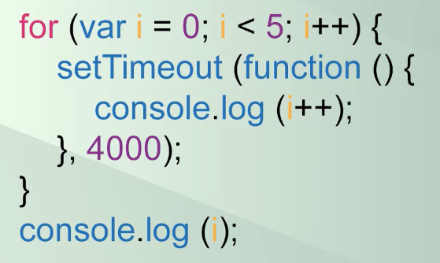

# JS Memos

## concurrency

```go
func main() {
	go greet("Nice to meet you!")
	go greet("How are you?")
	go slowGreet("How ... are ... you ...?")
	go greet("I hope you're liking the course!")
}
```

在运行这些函数作为 goroutines 时,我们在控制台上看不到任何输出。这是因为 goroutine 的设计目的是以非阻塞的方式运行函数,以便后续的操作和函数调用可以立即执行。当我们在 main 函数中启动这四个 goroutines 时,main 函数会立即结束并退出程序,导致我们看不到控制台输出。这是因为 goroutines 的特性是不会返回值,而调用它们的地方也不会等待它们完成。

- goroutine 旨在以非阻塞的方式运行函数
- 主函数会立即退出,而不会等待 goroutines 执行完毕
- goroutines 不会返回值,因此调用它们的地方也不会等待它们完成

## 闭包

> 理解闭包关键是理解作用域链
> 作用域链是一个重要的编程概念，它解释了如何在当前执行环境中查找变量。作用域链确保在当前作用域中可访问的变量和函数保持可用，同时保护这些变量不被外部环境访问。

### 作用域链的工作原理

在 JavaScript 中，当你声明一个函数，这个函数会创建一个新的作用域，这意味着在这个函数内部声明的变量和函数只能在这个函数内部被访问（局部作用域）。如果在一个函数内部访问一个变量时在当前作用域中找不到，JavaScript 引擎会查找包含（外部）作用域，直到找到该变量或者到达全局作用域为止。

### 示例

考虑以下代码：

```javascript
var globalVar = "global";

function outerFunc() {
  var outerVar = "outer";

  function innerFunc() {
    var innerVar = "inner";
    console.log(innerVar); // 访问内部变量
    console.log(outerVar); // 访问外部函数的变量
    console.log(globalVar); // 访问全局变量
  }

  innerFunc();
}

outerFunc();
```

在这个例子中：

1. **全局作用域**：包含变量 `globalVar`。
2. **`outerFunc` 的作用域**：包含变量 `outerVar` 和内嵌的 `innerFunc`。
3. **`innerFunc` 的作用域**：包含变量 `innerVar`。

当 `innerFunc` 被调用时，如果它需要访问一个变量，它首先查看自己的作用域。如果找不到，它接着查看 `outerFunc` 的作用域，再找不到则查看全局作用域。这种从内部作用域向外部作用域的查找过程就形成了一条“作用域链”。

### 作用域链的重要性

1. **变量解析**：作用域链影响变量的解析。变量总是在其被访问时沿作用域链向上查找直到被找到。
2. **性能**：变量查找时，查找距离当前执行环境越近的变量通常更快。深层作用域链中的变量解析可能稍慢。
3. **封装**：通过使用作用域链，可以有效地封装变量和函数，防止它们被外部环境错误访问或修改，提高代码的安全性和可维护性。

作用域链是理解闭包、执行上下文以及变量生命周期等 JavaScript 核心概念的基础。理解作用域链对于编写高效和安全的代码至关重要。


测试题，输出结果是什么：

```js
for (var i = 0; i < 5; i++) {
  setTimeout(() => {
    console.log(i++);
  }, 4000);
}
console.log(i);
```




<https://www.youtube.com/watch?v=LXJLgBjbh7w>
